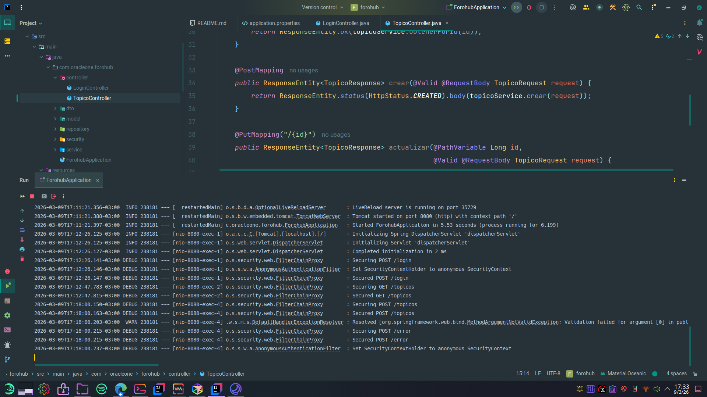
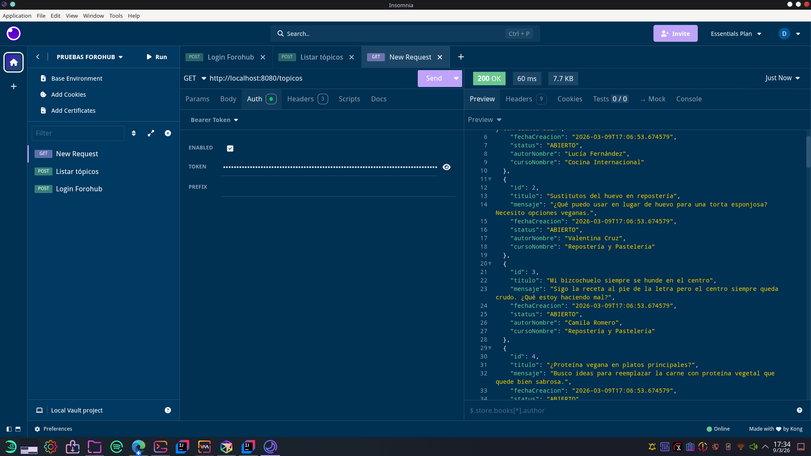

# ForoHub

API REST de foro con autenticación JWT. Desafío Oracle ONE - Challenge Back End (Foro Hub).

## Stack

- **Java 17**
- **Spring Boot 3.5.x**
- **PostgreSQL** (mismas credenciales que LiterAlura)
- **Flyway** para migraciones
- **Spring Security** + **JWT** (jjwt) para autenticación

## Requisitos

- JDK 17+
- Maven 3.9+
- PostgreSQL (base de datos `forohub` creada)

### Variables de entorno requeridas

| Variable | Descripción |
|----------|-------------|
| `DB_USER_SCREENMATCH` | Usuario de PostgreSQL |
| `DB_PASSWORD_POSTGRE` | Contraseña de PostgreSQL |
| `JWT_SECRET` | *(Opcional)* Clave para firmar JWT, mínimo 256 bits. Si se omite, se usa una clave de desarrollo. |

#### Linux / macOS — sesión actual (temporal)

```bash
export DB_USER_SCREENMATCH=tu_usuario
export DB_PASSWORD_POSTGRE=tu_contraseña
export JWT_SECRET=una-clave-secreta-larga-de-al-menos-32-caracteres
```

#### Linux — permanente (en `~/.bashrc` o `~/.profile`)

Agregá las líneas al final del archivo y luego ejecutá `source ~/.bashrc`:

```bash
export DB_USER_SCREENMATCH=tu_usuario
export DB_PASSWORD_POSTGRE=tu_contraseña
export JWT_SECRET=una-clave-secreta-larga-de-al-menos-32-caracteres
```

#### macOS — permanente (en `~/.zshrc` si usás zsh, o `~/.bash_profile` si usás bash)

```bash
export DB_USER_SCREENMATCH=tu_usuario
export DB_PASSWORD_POSTGRE=tu_contraseña
export JWT_SECRET=una-clave-secreta-larga-de-al-menos-32-caracteres
```

Luego ejecutá `source ~/.zshrc` (o `source ~/.bash_profile`).

#### Windows — PowerShell (sesión actual, temporal)

```powershell
$env:DB_USER_SCREENMATCH="tu_usuario"
$env:DB_PASSWORD_POSTGRE="tu_contraseña"
$env:JWT_SECRET="una-clave-secreta-larga-de-al-menos-32-caracteres"
```

#### Windows — permanente (variables del sistema)

1. Abrí el menú Inicio y buscá **"Editar las variables de entorno del sistema"**.
2. Clic en **Variables de entorno…**
3. En **Variables de usuario**, clic en **Nueva** y agregá cada variable:
   - Nombre: `DB_USER_SCREENMATCH` / Valor: tu usuario de PostgreSQL.
   - Nombre: `DB_PASSWORD_POSTGRE` / Valor: tu contraseña.
   - Nombre: `JWT_SECRET` / Valor: tu clave secreta (opcional).
4. Aceptá y reiniciá IntelliJ (o la terminal) para que tome los cambios.

#### IntelliJ IDEA — configuración de ejecución (todas las plataformas)

Si preferís no definir las variables a nivel de sistema operativo, podés configurarlas directamente en la ejecución:

1. Menú **Run → Edit Configurations…**
2. Seleccioná la configuración de `ForohubApplication`.
3. En el campo **Environment variables**, agregá:
   ```
   DB_USER_SCREENMATCH=tu_usuario;DB_PASSWORD_POSTGRE=tu_contraseña;JWT_SECRET=tu_clave
   ```
4. Aplicá y ejecutá.

## Crear la base de datos

En el servidor PostgreSQL:

```sql
CREATE DATABASE forohub;
```

## Ejecutar

```bash
mvn spring-boot:run
```

La API queda en `http://localhost:8080`.

---

## Autenticación

Todos los endpoints salvo `/login` requieren un token JWT en la cabecera:

```
Authorization: Bearer <token>
```

### POST /login

Obtiene el token JWT. Es el único endpoint público.

**Request:**

```http
POST /login
Content-Type: application/json
```

```json
{
  "email": "admin@forohub.local",
  "password": "password"
}
```

**Response 200:**

```json
{
  "token": "eyJhbGciOiJIUzI1NiJ9...",
  "type": "Bearer"
}
```

> Usuario de prueba creado por migración: email `admin@forohub.local`, password `password`.

---

## Endpoints de tópicos

> Todos requieren la cabecera `Authorization: Bearer <token>`.

### GET /topicos — Listar todos los tópicos

**Request:**

```http
GET /topicos
Authorization: Bearer <token>
```

**Response 200:**

```json
[
  {
    "id": 1,
    "titulo": "Duda sobre Spring Security",
    "mensaje": "¿Cómo configuro JWT con filtros?",
    "fechaCreacion": "2026-03-09T10:00:00",
    "status": "ABIERTO",
    "autorNombre": "Usuario Demo",
    "cursoNombre": "Spring Boot 3"
  }
]
```

---

### GET /topicos/{id} — Detalle de un tópico

**Request:**

```http
GET /topicos/1
Authorization: Bearer <token>
```

**Response 200:**

```json
{
  "id": 1,
  "titulo": "Duda sobre Spring Security",
  "mensaje": "¿Cómo configuro JWT con filtros?",
  "fechaCreacion": "2026-03-09T10:00:00",
  "status": "ABIERTO",
  "autorNombre": "Usuario Demo",
  "cursoNombre": "Spring Boot 3"
}
```

**Response 404** — si el id no existe:

```json
{
  "status": 404,
  "error": "Not Found",
  "message": "Tópico no encontrado con id: 99"
}
```

---

### POST /topicos — Crear un tópico

El body requiere los **ids** numéricos de autor y curso (no sus nombres).  
Para conocer los ids disponibles, consultá primero `GET /topicos` o ejecutá un `SELECT` en la BD.

**Request:**

```http
POST /topicos
Authorization: Bearer <token>
Content-Type: application/json
```

```json
{
  "titulo": "Uso de plugins nativos para producción musical en GNU/Linux",
  "mensaje": "¿Hay mejoras notables de rendimiento al usar plugins VST nativos de Linux?",
  "autorId": 2,
  "cursoId": 6,
  "status": "ABIERTO"
}
```

> `status` es opcional; si se omite queda como `"ABIERTO"` por defecto.

**Response 201:**

```json
{
  "id": 26,
  "titulo": "Uso de plugins nativos para producción musical en GNU/Linux",
  "mensaje": "¿Hay mejoras notables de rendimiento al usar plugins VST nativos de Linux?",
  "fechaCreacion": "2026-03-09T17:30:00",
  "status": "ABIERTO",
  "autorNombre": "Martín Sosa",
  "cursoNombre": "Producción Musical Digital"
}
```

**Response 400** — si falta algún campo obligatorio (titulo, mensaje, autorId, cursoId):

```json
{
  "status": 400,
  "error": "Bad Request",
  "message": "Validation failed for object='topicoRequest'. Error count: 2"
}
```

**Response 409** — si ya existe un tópico con el mismo título y mensaje:

```json
{
  "status": 409,
  "error": "Conflict",
  "message": "Ya existe un tópico con el mismo título y mensaje"
}
```

---

### PUT /topicos/{id} — Actualizar un tópico

Mismas reglas de validación que el POST. Todos los campos son obligatorios.

**Request:**

```http
PUT /topicos/1
Authorization: Bearer <token>
Content-Type: application/json
```

```json
{
  "titulo": "Duda sobre Spring Security (resuelta)",
  "mensaje": "¿Cómo configuro JWT con filtros?",
  "autorId": 1,
  "cursoId": 1,
  "status": "CERRADO"
}
```

**Response 200:**

```json
{
  "id": 1,
  "titulo": "Duda sobre Spring Security (resuelta)",
  "mensaje": "¿Cómo configuro JWT con filtros?",
  "fechaCreacion": "2026-03-09T10:00:00",
  "status": "CERRADO",
  "autorNombre": "Usuario Demo",
  "cursoNombre": "Spring Boot 3"
}
```

**Response 404** — si el id no existe.  
**Response 409** — si el nuevo título + mensaje ya pertenecen a otro tópico.

---

### DELETE /topicos/{id} — Eliminar un tópico

**Request:**

```http
DELETE /topicos/1
Authorization: Bearer <token>
```

**Response 204** — sin cuerpo de respuesta.  
**Response 404** — si el id no existe.

---

## Estructura de la base de datos (Flyway)

| Migración | Descripción |
|-----------|-------------|
| V1 | tabla `curso` |
| V2 | tabla `autor` |
| V3 | tabla `usuario` (login) |
| V4 | tabla `topico` |
| V5 | usuario demo para login |
| V6 | curso y autor de ejemplo |
| V7 | corrección de hash del usuario demo |
| V8 | hash definitivo del usuario demo |
| V9 | cursos, autores y tópicos demo (cocina, música, viajes) |
| V10 | tópicos demo sobre Spring Boot 3 |

## Reglas de negocio

- `titulo`, `mensaje`, `autorId` y `cursoId` son obligatorios al crear o actualizar un tópico.
- No se permiten tópicos duplicados (mismo `titulo` y mismo `mensaje`).
- `autorId` y `cursoId` deben existir en la base de datos.

---

## Capturas de pantalla

### Aplicación en ejecución (IntelliJ IDEA)



### Prueba de endpoints (Insomnia)


